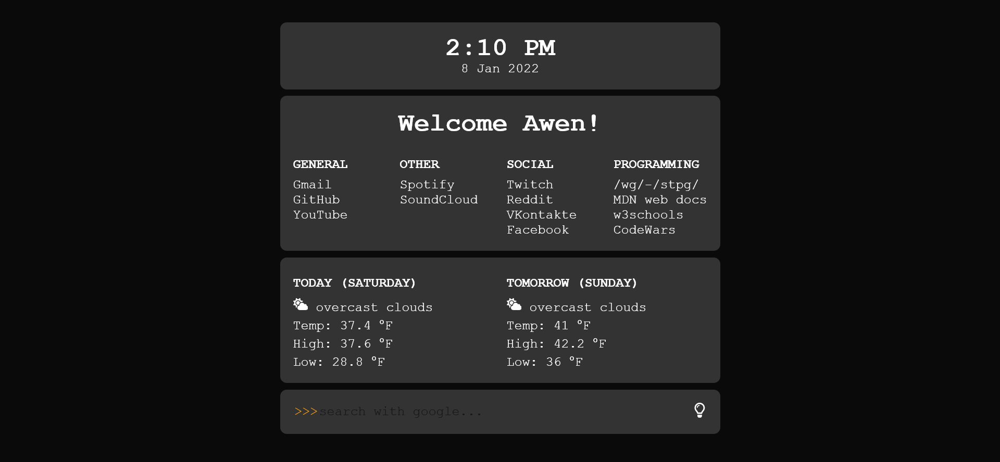
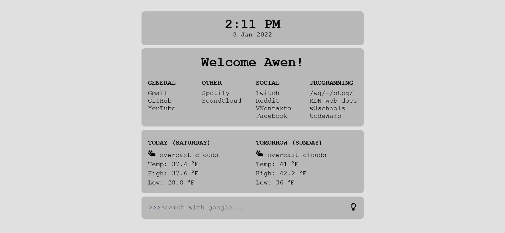

<h1 align="center">Preview</h1>




<h1 align="center">Installation</h1> 

### Installation on Firefox

<ol>
    <li>Clone this repository
    <li>Open firefox and go to Preferences > Home
    <li>In homepage and new windows add custom URL
    <li>Go to newtab folder and open mozilla.cfg in an editor
    <li>Replace file location of index.html in newTabURL variable
    <li>Copy mozilla.cfg to /usr/lib/firefox/
    <li>Copy local-settings.js to /usr/lib/firefox/defaults/pref/
</ol>

#### The normal way
- Windows: ```C:\Program Files\Mozilla Firefox\```
- macOS: ```/Applications/Firefox.app/Contents/MacOS```
- Linux: ```/opt/firefox/```

`autoconfig.js` 
```js
pref("general.config.filename", "mozilla.cfg");
pref("general.config.obscure_value", 0);
pref("general.config.sandbox_enabled", false);
```
`mozilla.cfg`
```js
let { classes:Cc, interfaces:Ci, utils:Cu } = Components;

try {
  Cu.import("resource:///modules/AboutNewTab.jsm");
  let newTabURL = "PATH_TO_STARTPAGE_REPLACE_ME";
  AboutNewTab.newTabURL = newTabURL;
} catch(e) { Cu.reportError(e); }
```

`PATH_TO_STARTPAGE_REPLACE_ME` should be replaced with the file path to your startpage


